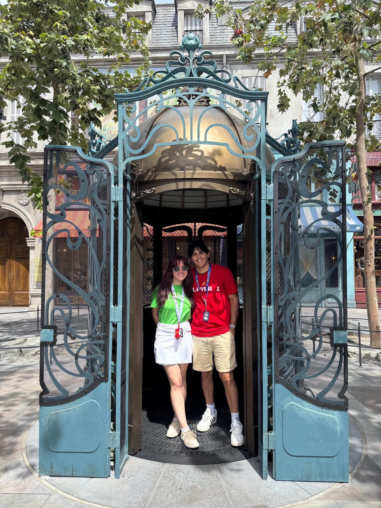

```{r}
```

<p align="center">
  
</p>

# About me
<br>
I am a first year **Masters of Engineering in Bioengineering** student, currently developing a project in a hybrid **Brain-Computer Interface** (hBCI) in conjunction with electrooculography (EOG) for assisted rehabilitation of quadriparetic patients. I've prior exposure to R and R Studio, yet have not delved into it as much as this class will.

# Chunks 
```{r echo = F, warning = F, message = F}
14 + 13
library(ggplot2)
```
# Tables

| T/F | Echo  | Warning  | Include |
| --------- | --------- | --------- |
| TRUE | Show code, show results | Shows warning in final output | Shows code and results |
| FALSE | Hide code, show results | Hides warning in final output | Hides code and hides results |